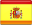
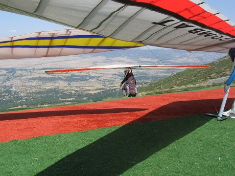

<h2 class="welcome">Welcome to Piedrahita 2013! </h2>

Welcome to the official website of the **Spanish National Championship and International Hang Gliding Open Piedrahita 2013**.

**Event:** Spanish National Championship and International Hang Gliding Open: Category 2 FAI Open to flexwing, rigid and sports classes.

**Date:** July 19-27, 2013

**Location:** Piedrahita, Ávila, España

**GPS Coordinates:** 40°27′46″ North, 5°19′40″ West

**Web page**: [piedrahita2013.com](/presentation.html)

**Programme:**

* **April 1st**: [On-line sign up opening](signup.html)
* **June 15th**: Last day for reduced registration fee
* **From July's first to 18th**: Free training days
* **Thursday 18th from 17:30 to 21:30**: Registration at the headquarters
* **Thursday 18th at 22:00**: First pilot's briefing at the headquarters
* **From 19th to 27th**: Competition days
* **Saturday 27th 21:00h**: Closing ceremony

Places are limited to {{site.pilots_limit}} pilots.

**Championship regulations:**

* [Regulations of the Spanish National Championship and International Open Piedrahita 2013](downloads/Reglamento_Cto_de_Espana_Piedrahita_2013.pdf)

**Fee:**

The registration fee is **{{site.nice_price}}&euro;**.

Registration includes:

* Event T-shirt
* Maps
* Tickets for the municipal swimming pool
* Prize draw entry
* Closing dinner and party

**Prepayment:**

For registration, find the banks details below:

 

Also you can use this email address to let us know any question, feedback or suggestion.
