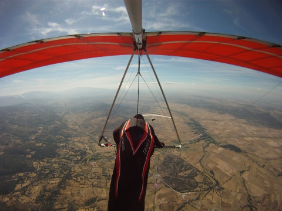

<h2>Welcome <a href="presentacion.html">Presentación</a></h2>

Bienvenidos a la web del **Campeonato de España y Open Internacional de Ala Delta Piedrahita 2013**.

**Evento:** Campeonato de España Ala Delta: Categoria 2 FAI acogerá las clases flexibles, rigidas y sport

**Fechas:** Del 19 al 27 de julio de 2013

**Localidad:** Piedrahita, Ávila, España

**Coordenadas GPS:** 40°27′46″ Norte, 5°19′40″ Oeste

**Programa:**

* **Jueves 18**: Inscripciones en ??????????????????? (desde las 17:30 hasta las 21:30)
* **?????? 1?**: Cena de bienvenida
* **Del 19 al 27**: Dias de competición
* **Sábado 27 21:00h**: Ceremonia de clausura, entrega de trofeos, sorteos y fiesta de despedida

Las plazas estarán limitadas a 120 pilotos.

El precio de la inscripción será de 120€ por participante siempre que se haga la inscripción antes del 15 de Junio del 2013, después el coste será de 130€.

La inscripción incluye:

* Cena de Bienvenida para pilotos y acompañantes (confirmad asistencia durante incripción).
* Camiseta del campeonato
* Avituallamiento en el despegue
* Mapas
* Entrada para la piscina municipal
* Sorteo de Material
* Cena de clausura y fiesta de cierre de campeonato

Para relizar la inscripción hacer la transferencia indicando vuestros datos al siguiente número de cuenta:

 

